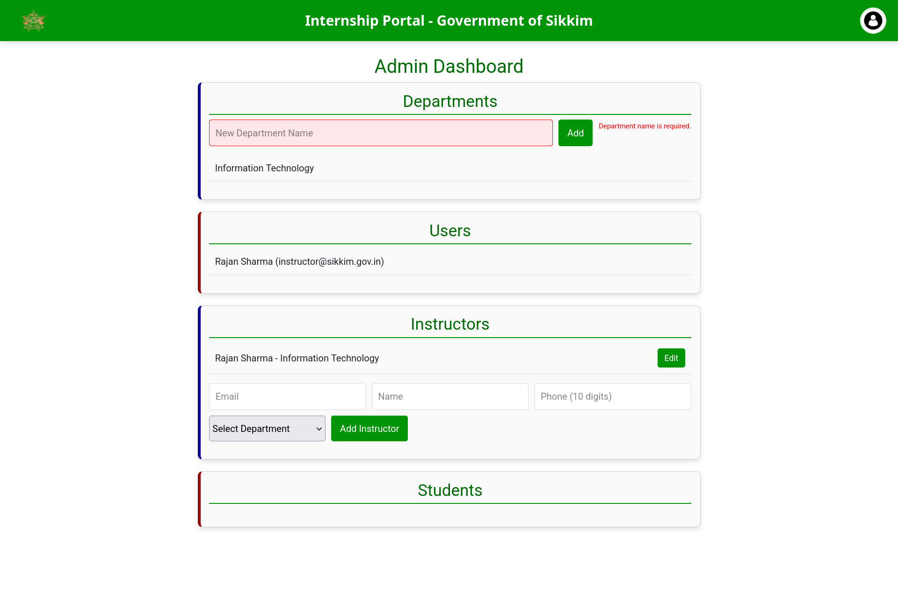
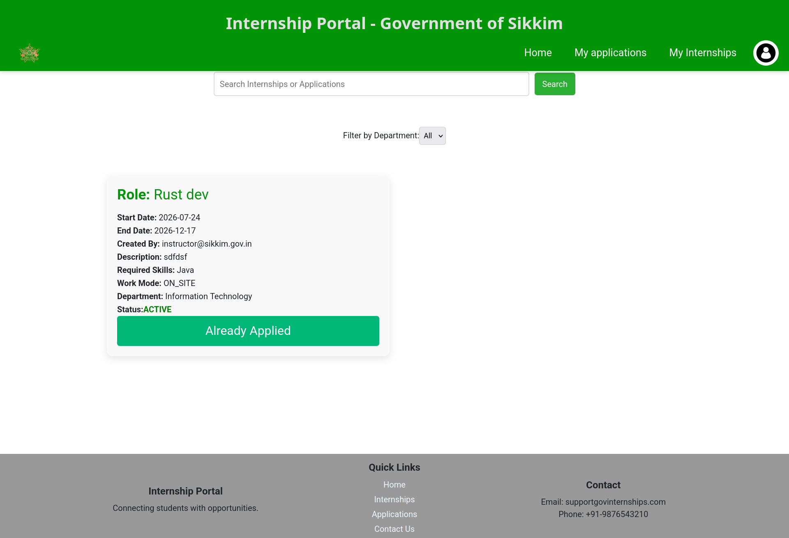
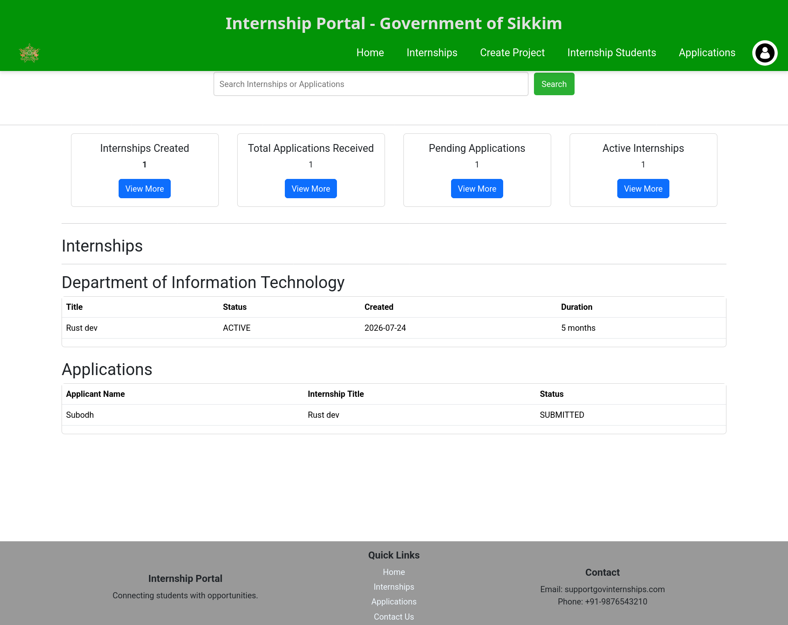

# Internship Portal for Government of Sikkim

[![Contributors][contributors-shield]][contributors-url]
[![Issues][issues-shield]][issues-url]
[![GNU License][license-shield]][license-url]
-----------------------------------------------
## Highlight

Production system delivered for the Department of IT, Government of Sikkim.

## 🔥 Contributors

**Subodh Adhikari**

[](https://www.linkedin.com/in/subodh-adhikari-4b811a296/)
[](mailto:subodhadhikari2023@outlook.com)
[](https://github.com/subodhadhikari2023/)

---

## 📖 Overview

The **Internship Portal** is a web-based platform developed to digitize the internship application and management process for students applying under the **Government of Sikkim, Department of Information Technology**. It provides students and administrators with tools for application submission, project file storage, status tracking, and certificate issuance.

## 🎯 Features

### **For Students/Interns**
- Online application for internships.
- Application status tracking.
- Upload and manage project files in a centralized repository.
- Request and claim internship completion certificates.
- Receive real-time email notifications about application progress.

### **For Administrators**
- Manage and approve internship applications.
- Track and monitor internship progress.
- Generate and issue completion certificates.
- Provide real-time updates to students.

## Tech Stack

<div align="center">

**Frontend**

   

**Backend**

   

**Database**


**DevOps & Tools**

      

</div>

<!-- Portfolio sync reads the bullet list below -->
- Angular 14
- TypeScript
- Spring Boot
- Spring Security
- JWT
- Hibernate/JPA
- MySQL
- Spring MVC
- REST API
- Docker
- Docker Compose
- Maven
- IntelliJ IDEA
- VS Code
- Git
- HTML/CSS
- Postman

## 🔍 Problem Statement

Currently, the **internship cycle is managed manually** using offline methods, leading to:
- Delayed application processing.
- No centralized repository for storing and sharing project files.
- Difficulty in tracking and managing different stages of the internship.
- Time-consuming manual certification process.
- Lack of real-time updates and notifications.

## 💡 Solution Approach

The **Internship Portal** addresses these issues by:
- Providing a **web-based registration system** for students.
- Implementing a **centralized project file repository** with role-based access control.
- Automating the **certificate issuance** process.
- Enabling **email notifications** for important updates.
- Offering a **dashboard for administrators** to manage and track internships efficiently.

## 🛠 Installation Guide

### **Prerequisites**
- **Java 17** installed
- **Node.js & npm** installed
- **MySQL 8.0.33** installed
- **Git** installed

### **Steps to Run the Project Locally**
1. **Clone the Repository**
   ```sh
   git clone https://github.com/subodhadhikari2023/Internship-Portal.git
   cd Internship-Portal
   ```

2. **Backend Setup (Spring Boot)**
   ```sh
   cd backend
   mvn clean install
   mvn spring-boot:run
   ```

3. **Frontend Setup (Angular)**
   ```sh
   cd frontend
   npm install
   ng serve
   ```

4. **Database Setup**
   - Create a MySQL database named `internship_portal`
   - Configure database credentials in `application.properties`

5. **Access the Application**
   - **Frontend:** `http://localhost:4200`
   - **Backend API:** `http://localhost:8080/internship-portal/api/v1`


## Screenshots





## 📜 License

Distributed under the **MIT License**. See LICENSE for more information.

## 📬 Contact

For any queries or suggestions, feel free to contact:
- **Email:** subodhadhikari2023@outlook.com
- **GitHub Issues:** [Open an Issue](https://github.com/subodhadhikari2023/Internship-Portal/issues)

---

[contributors-shield]: https://img.shields.io/github/contributors/subodhadhikari2023/Internship-Portal?style=for-the-badge
[contributors-url]: https://github.com/subodhadhikari2023/Internship-Portal/graphs/contributors
[issues-shield]: https://img.shields.io/github/issues/subodhadhikari2023/Internship-Portal?style=for-the-badge
[issues-url]: https://github.com/subodhadhikari2023/Internship-Portal/issues
[license-shield]: https://img.shields.io/badge/License-GPLv3-blue.svg
[license-url]: https://github.com/subodhadhikari2023/Internship-Portal/blob/main/LICENSE
